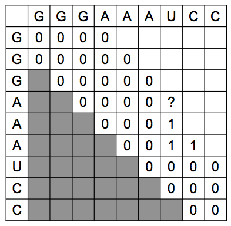

**miranda** is a [miRNA](https://en.wikipedia.org/wiki/MicroRNA) sequence analyzer written in Java.  
It computes an optimal [secondary structure](https://en.wikipedia.org/wiki/Nucleic_acid_secondary_structure) from a given basis sequence, regarding the released conformation energy and the number of matched basis.  
It is endowed with a graphical user interface for ease of use.

###### Basic background
DNA and RNA are nucleic acids which are major macromolecules for all forms of life.  
They differ in their chemical structure since RNA is single-stranded as opposed to DNA.  
A miRNA is a small non-coding RNA, which dysregulation can lead to known [diseases](https://en.wikipedia.org/wiki/MicroRNA#Disease) and cancer.  
It tends to fold to itself while attempting to reach stability that is:

- a maximal number of matched basis,
- a minimal released energy induced by the conformation process.

<table>
  <tr>
    <td></td>
    <td></td>
  </tr>
</table>

RNA primary structure simply refers to its basis sequence.  
Its secondary structure refers to its planar conformation.  
Its ternal structure refers to its real spatial conformation.  
The conformation topology can be complex, but is simplified for miRNAs.  
In this case, it consists of single strand without [pseudoknots](https://en.wikipedia.org/wiki/Pseudoknot).

---

### Build and use
###### Build

**miranda** is cross-platform.   
It requires a recent Java Runtime Environment installed.  
It relies on [gradle](https://gradle.org) toolchain to build binaries, but it is not required to install the latter though.  
To build and run from sources, just open a terminal and type:

```bash
./gradlew clean
./gradlew build
./gradlew run
```
> Use `gradlew.bat` instead on Windows.

You can also create native executables for macOS and Windows:

```bash
./gradlew createApp       # for macOS  
./gradlew createExe       # for Windows
```
Related files are then located within `build/macApp` or `build/launch4j`.

###### Using the GUI

**miranda** is endowed with a graphical user interface:


1. menu to load and run a given `.txt` basis sequence file.
2. imported sequence file content.
3. resulting secondary structure pattern after the run.
4. conformation energy criterion used for the current run.
5. stats on the resulting secondary structure.

The conformation energy matrix used for the computation is accessible as well:


> Results can then be saved by a drap-and-drop to an empty file.

-----

### Algorithm

###### In a nutshell

**miranda** uses a [dynamic programming](https://en.wikipedia.org/wiki/Dynamic_programming) scheme.  
It actually implements [Nussinov](http://math.mit.edu/classes/18.417/Slides/rna-prediction-nussinov.pdf) algorithm.  
It relies on the computation of each basis pair energy, with 4 cases:

  

The energy of a given secondary structure is just the sum of matched pairs ones.  
Hence an optimal conformation is an instance which minimizes this energy (which can be multiple).

    

In fact, redundant recursive calls are avoided since only the three cases are taken into account.  
The resolution algorithm involves three steps:

- remove all impossible pairs.
- fill energy and matched pairs matrices (diagonal by diagonal).   
- retrieve index path by backtracking from the very last cell.

<table>
  <tr>
    <td></td>
    <td></td>
    <td></td>
  </tr>
</table>

###### Future works

I aim to integrate the retrieval of _k_ optimal and suboptimal solutions for a given _k_.  
It will enable to consider and retrieve all isomorphic solutions.

-------


###### Copyright 2014, Hoby Rakotoarivelo

[](https://www.apache.org/licenses/LICENSE-2.0)

**miranda** is released under the [Apache](https://www.apache.org/licenses/LICENSE-2.0) license.  
It was written for experimental purposes, but improvements are welcome.    
To get involved, you can:

-    report bugs or request features by submitting an [issue](https://github.com/hobywan/miranda/issues).
-    submit code contributions using feature branches and [pull requests](https://github.com/hobywan/miranda/pulls).

Enjoy! 😉