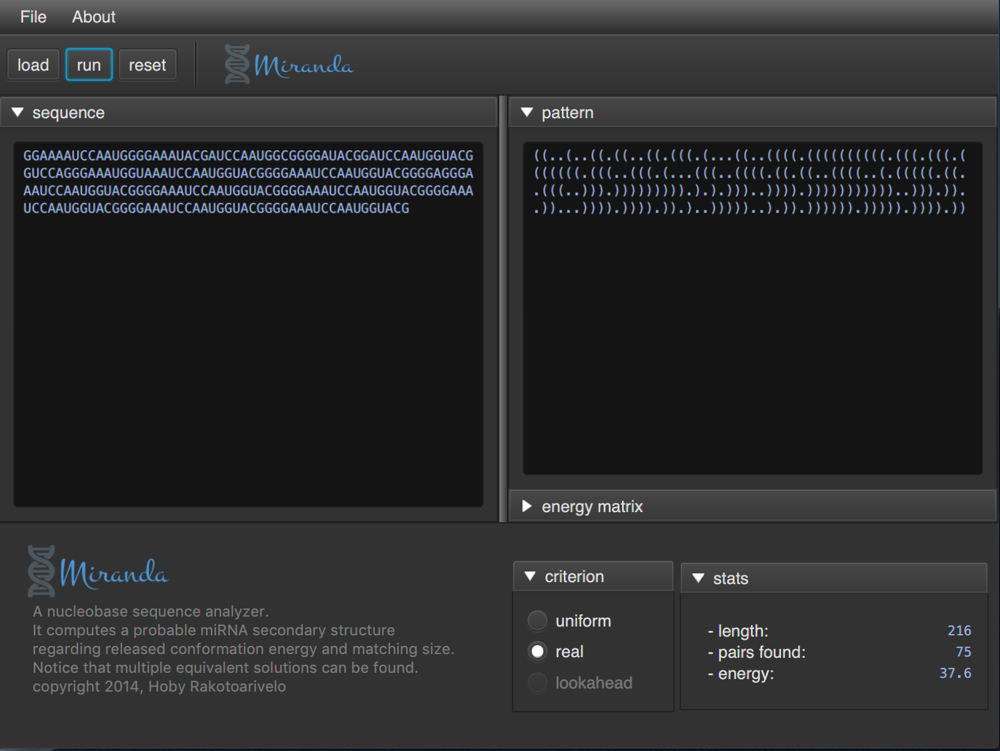
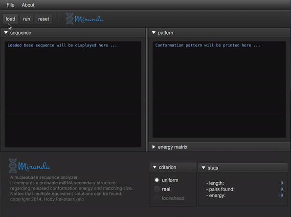

[](https://travis-ci.com/hobywan/miranda)
[](https://ci.appveyor.com/project/hobywan/miranda)
[](https://www.codacy.com/app/hobywan/miranda?utm_source=github.com&amp;utm_medium=referral&amp;utm_content=hobywan/miranda&amp;utm_campaign=Badge_Grade)
<!--[](https://www.apache.org/licenses/LICENSE-2.0)
-->

**miranda** is a [nucleobase](https://en.wikipedia.org/wiki/Nucleobase) sequence analyzer written in Java.  
It computes a probable [miRNA](https://en.wikipedia.org/wiki/MicroRNA) [secondary structure](https://en.wikipedia.org/wiki/Nucleic_acid_secondary_structure) from a given sequence,  
regarding the released conformation energy and the number of matched bases.  
It is endowed with a graphical user interface based on [JavaFX](https://openjfx.io):



###### Table of contents

- [Build instructions](#build)
- [Feature and algorithm](#feature)
- [How to contribute](#license)

---

### Build and use <a name="build"></a>
###### Build

[](https://travis-ci.com/hobywan/miranda)
[](https://ci.appveyor.com/project/hobywan/miranda)

**miranda** is cross-platform.   
It requires a [recent](https://www.oracle.com/technetwork/java/javase/downloads/index.html) Java SE to be built from sources (at least 11).  
It relies on [gradle](https://gradle.org) toolchain to build binaries, but it is self-managed though.  
To build and run it, just open a terminal and type:

```bash
./gradlew run                 # on macOS or Linux
gradlew.bat run               # on Windows
```

If you want to create executables, type:

```bash
./gradlew createApp           # on macOS  
gradlew.bat createExe         # on Windows
```
> They will be located under `build/macApp` or `build/launch4j`.

###### Use

**miranda** is very simple to use:



Its user interface enables to:

- import and run a given `.txt` sequence file.
- display predicted miRNA secondary structure pattern.
- select conformation energy criterion.
- show stats and conformation energy matrix.

> You can save results by a drag-and-drop to a file.

-----

### Feature <a name="feature"></a>

###### Basic background
[DNA](https://en.wikipedia.org/wiki/DNA) and [RNA](https://en.wikipedia.org/wiki/RNA) are nucleic acids which are major macromolecules for all forms of life.  
They differ in their chemical structure since RNA is single-stranded as opposed to DNA.  
A [miRNA](https://en.wikipedia.org/wiki/MicroRNA) is a small [non-coding](https://en.wikipedia.org/wiki/Non-coding_RNA) RNA, which dysregulation can lead to known [diseases](https://en.wikipedia.org/wiki/MicroRNA#Disease) and cancer.  
It tends to fold to itself while attempting to reach stability that is:

- a maximal number of matched bases,
- a minimal released energy induced by the conformation process.

<table>
  <tr>
    <td></td>
    <td></td>
  </tr>
</table>

A nucleic acid [primary structure](https://en.wikipedia.org/wiki/Nucleic_acid_structure#Primary_structure) simply refers to its base sequence.  
Its [secondary structure](https://en.wikipedia.org/wiki/Nucleic_acid_structure#Secondary_structure) refers to its planar conformation.  
Its topology can be quite complex, but is simplified for miRNAs.  
Indeed, it would consist of simple [pseudoknots](https://en.wikipedia.org/wiki/Pseudoknot)-free strand.

###### Algorithm

**miranda** uses a [dynamic programming](https://en.wikipedia.org/wiki/Dynamic_programming) scheme.  
It actually implements [Nussinov](http://math.mit.edu/classes/18.417/Slides/rna-prediction-nussinov.pdf) algorithm.  
It relies on the computation of each base pair energy, with 4 cases:

  

The energy of a given secondary structure is just the sum of matched pairs ones.  
Hence an optimal conformation is an instance which minimizes this energy (which can be multiple).

    

In fact, redundant recursive calls are avoided since only the three cases are taken into account.  
The resolution algorithm involves three steps:

- remove all impossible pairs.
- fill energy and matched pairs matrices (diagonal by diagonal).   
- retrieve index path by backtracking from the very last cell.

<table>
  <tr>
    <td></td>
    <td></td>
    <td></td>
  </tr>
</table>

###### Future works

Notice that computed solutions are just miRNA **candidates**.  
I will integrate _k_ optimal and suboptimal solutions retrievals for a given _k_.  
It will enable to consider and retrieve all isomorphic solutions.


-------
### <a name="license">License</a>

###### Copyright 2014, Hoby Rakotoarivelo

[](https://www.apache.org/licenses/LICENSE-2.0)

**miranda** is released under the [Apache](https://www.apache.org/licenses/LICENSE-2.0) license.  
It was written for experimental purposes, and improvements are welcome.    
To get involved, you can:

-    report bugs or request features by submitting an [issue](https://github.com/hobywan/miranda/issues).
-    submit code contributions using feature branches and [pull requests](https://github.com/hobywan/miranda/pulls).

Enjoy! 😉